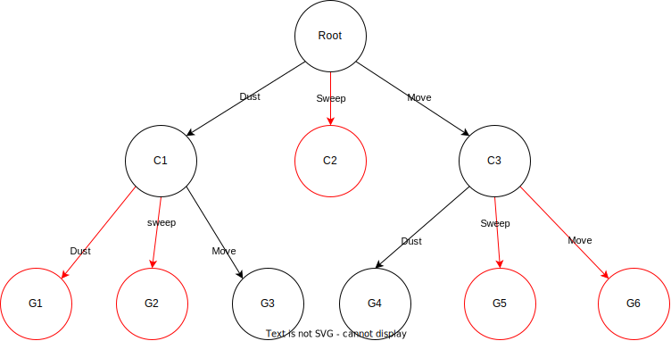
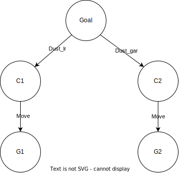
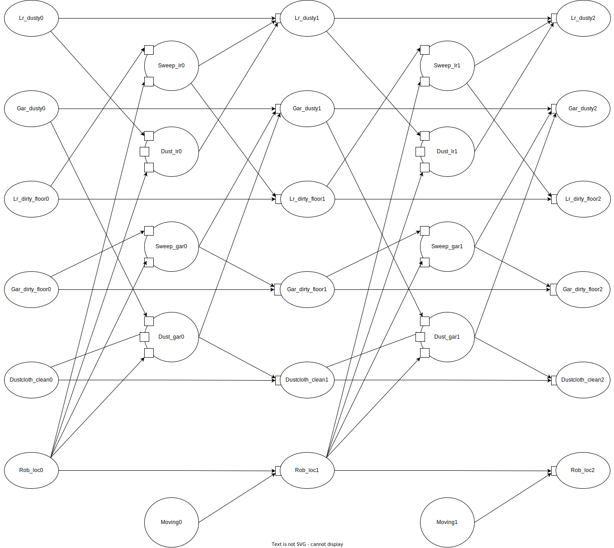

Rooms can be dusted (making the room dust free) or swept (having a room have a clean floor), and the robot can only do this action if it's inside the room. 
Swiping has the side effect of turning the room dusty, and the robot can only dust a room if the dust cloth is clean. 
Dusting a room which is extra dusty (like garage) makes the dust cloth be dirty. 
The robot can move between rooms directly.

The environment:
- **Garage**: if it is dusty, it's extra dusty 
- **living room (lr)**
The robot knows:
- **Lr_dusty** is true when the living room is dusty. 
- **Gar_dusty** is true when the garage is dusty. 
- **Lr_dirty_floor** is true when the living room floor is dirty. 
- **Gar_dirty_floor** is true when the garage floor is dirty. 
- **Dustcloth_clean** is true when the dust cloth is clean.
- **Rob_loc** is the location of the robot, with values {garage,lr}.
The robot can do:
- **move**: move to the other room 
- **dust**: dust the room the robot is in, as long as the room is dusty and the dustcloth is clean. 
- **sweep**: sweep the floor the robot is in.
# Questions
(1) Give the STRIPS representation for dust

```
dust_garage:
	precondition 
		[Gar_dusty, Dustcloth_clean, Rob_loc=garage]
	effect
		[!Gar_dusty, !Dustcloth_clean]
sweep_garage:
	precondition
		[Gar_dirty_floor, Rob_loc=garage]
	effect
		[!Gar_dirty_floor, Gar_dusty]	
		
dust_lr:
	precondition
		[Lr_dusty, Dustcloth_clean, Rob_loc=lr]
	effect
		[!Lr_dusty]
sweep_lr:
	precondition
		[Lr_dirty_floor, Rob_loc=lr]
	effect
		[!Lr_dirty_floor, Lr_dusty]	
```

---
(2) Give the feature-based representation for lr_dusty
Causal rules:
- The room is not dusty after being dusted:  $Lr\_dusty=false \leftarrow Act=dust \wedge Rob\_loc = lr$ 
- The room becomes dusty if it is swept: $Lr\_dusty=true \leftarrow Act=sweep \wedge Rob\_loc = lr$ 

Frame rules: (???)
- If the robot is in another room: $Lr\_dusty \leftarrow Lr\_dusty \wedge Rob\_loc \ne lr$ 

---
(3) Suppose that the initial state is that the robot is in the garage, both rooms are dusty but have clean floors and the goal is to have both rooms not dusty. Draw the first two levels (with two actions, so the root has children and grandchildren) of a forward planner with multiple-path pruning, showing the actions (but you do not have to show the states). Show explicitly what nodes are pruned through multiple-path pruning



In red are shown the paths that are pruned, as they lead to an already visited state, this means that paths from that path can be ignored (as shown for C2), the next paths to visit will be G3 and G4

---
(4) Pick two of the states at the second level (after two actions) and show what is true in those states
**G3**: 
- Rob_loc = lr
- Lr_dusty = true
- Gar_dusty = false
- Lr_dirty_floor = false
- Gar_dirty_floor = false
Lr_dusty is true, the next step would be to dust the living room

**G4**:
- Rob_loc = lr
- Lr_dusty = false
- Gar_dusty = true
- Lr_dirty_floor = false
- Gar_dirty_floor = false
Gar_dusty is true, the next step would be to dust the garage
---
(5) Suppose that the initial state is that the robot is in the garage, both rooms are dusty but have clean floors and the goal is to have both rooms not dusty. Draw the first two levels (with two actions, so the root has children and grandchildren) of a regression planner showing the actions but you do not have to show what the nodes represent



Going from the goal, the last two actions will be sweeping either the living room or garage, the grandchild actions would be the opposite actions of moving from the living room to garage, and the opposite

---
(6) Pick two of the nodes at the second level (after two actions) and show what the subgoal is at those nodes

**G1**: The robot is in the living room and the living room is dusty, the subgoal of this node is to dust the living room ($\neg Lr\_dusty$)

**G2**: The robot is in the garage and the garage is dusty, the subgoal of this node is to dust the garage ($\neg Gar\_dusty$)

---
(7) Draw the CSP for a planning horizon of two. Describe each constraint in English by specifying which values are (in)consistent

State features (inherited from the problem):
- **Lr_dusty** is true when the living room is dusty. 
- **Gar_dusty** is true when the garage is dusty. 
- **Lr_dirty_floor** is true when the living room floor is dirty. 
- **Gar_dirty_floor** is true when the garage floor is dirty. 
- **Dustcloth_clean** is true when the dust cloth is clean.
- **Rob_loc** is the location of the robot, with values {garage,lr}.

Action features:
- **Sweep_lr**: is true when the living room is being swept
- **Sweep_gar**: is true when the garage is being swept
- **Dust_lr**: is true when the living room is being dusted
- **Dust_gar**: is true when the garage is being dusted
- **moving**: is true if the robot is moving to the next room (since we only have two adjacent rooms, we can define this as a boolean value)

Inconsistent constraints:
	TODO
 

